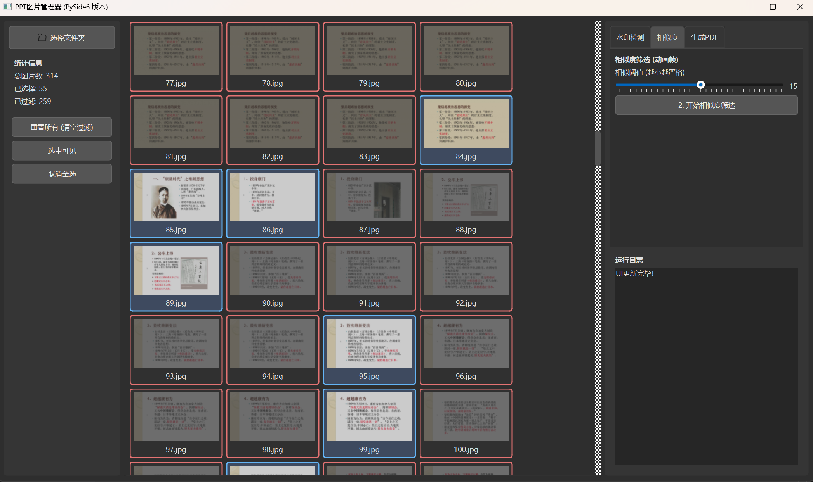

# 🚀 PPT 图片清理器 (PPT Image Cleaner)



这是一个使用 Python 和 PySide6 开发的桌面工具，专为需要处理大量 PPT 导出图片（如学生、教师）的用户设计。

本项目最初的灵感来自于 Zju-learn-assistant 下载的智云课堂图片处理需求，它能有效解决图片集中存在大量水印、空白页和重复动画帧的问题，快速将一个杂乱的图片文件夹，清理并合并成一个干净、可阅读的 PDF 讲义。

## 🚀 快速开始 (面向用户)

1.  前往本仓库的 **[Releases 页面](https://github.com/你的用户名/你的仓库名/releases)**。
2.  下载最新的 `.exe` 文件（例如 `ppt_cleaner_v1.0.exe`）。
3.  直接运行即可。

*(注：目前仅支持 Windows。Mac 和 Linux 平台待定。)*

## ✨ 核心功能

* **视觉预览**: 在一个响应式的网格布局中实时预览所有图片。
* **手动微调**: 支持完全的手动操作，可以随时点击任何图片来选中或取消选中。
* **批量操作**: 提供 "重置所有 (清空过滤)"、"选中可见" 和 "取消全选" 按钮，方便快速管理。
* **智能水印检测**:
    * 使用 OpenCV (`cv2.matchTemplate`) 进行模板匹配。
    * 支持**调整匹配阈值**。
    * 支持**反转逻辑**（例如，从“排除无水印的”变为“排除*含*水印的”）。
    * 支持在“所有图片”或“仅选中的图片”之间切换检测范围。
* **动画帧精简**:
    * 使用感知哈希 (`imagehash`) 来比较图片相似度。
    * 自动过滤（排除）在视觉上高度相似的图片（例如 PPT 动画的中间帧）。
    * 支持**调整相似度阈值**。
* **一键导出**: 将所有最终选中的图片，按正确顺序合并为一个 PDF 文件。

## 📖 使用指南

1.  点击 **"选择文件夹"** 加载你的 PPT 图片。
2.  **（可选）水印检测**：
    * 点击 **"选择水印模板"** 加载一个水印小图。
    * 根据需要勾选 "反转逻辑" 或 "针对所有图片"。
    * 点击 **"开始水印检测"**。
3.  **（可选）相似度筛选**：
    * 调整 **"相似阈值"**。
    * 根据需要勾选 "针对所有图片"（默认只在已选中的图片中执行）。
    * 点击 **"开始相似度筛选"**。
4.  **（可选）手动调整**：
    * 使用 "重置所有"、"选中可见"、"取消全选" 按钮。
    * 直接点击网格中的任意图片 来切换其选中状态。
5.  **导出 PDF**：
    * 在 "生成PDF" 选项卡中 设置输出路径。
    * 点击 **"生成PDF"**。

## 🛠️ 如何从源码运行 (面向开发者)

**1. 克隆仓库**
```bash
git clone [https://github.com/你的用户名/你的仓库名.git](https://github.com/你的用户名/你的仓库名.git)
cd 你的仓库名